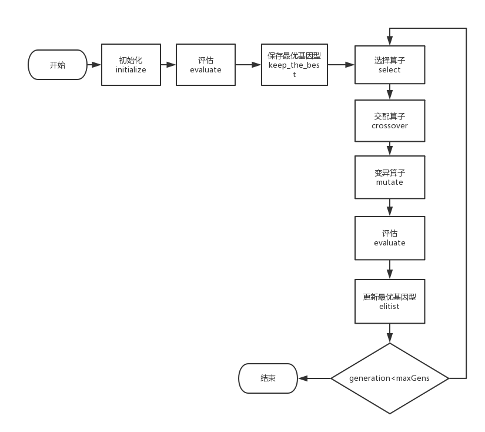

# Python - Time Series

嗯，造轮子总是无法避免的，让我们开心的造轮子吧！

## Naive_TS_Similarity

Outline:
~~~python
class Naive_TS_Similarity(object):
'''
一个Naive的时间序列相似性测量类，
包括欧氏距离(ED)、DTW距离和Z-Normalization。
为了体现Naive的一面，特地没有使用向量化实现。
'''
    def ED(a,b):
    '''
    接收参数：两个等长的时间序列
    返回结果：它们之间的欧氏距离(ED)
    '''
    def DTW(a, b, print_detail=True):
     '''
    接收参数：两个时间序列，以及是否打印详情
    返回结果：它们之间的DTW距离
    '''
    def z_normalization(a):
    '''
    接收参数：一个时间序列
    返回结果：正态化后的时间序列，旧均值，旧方差
    '''
~~~ 

## GA - 遗传算法

参数要求：

1. popSize - 基因型数量
2. maxGens - 最大迭代次数 
3. varBound - list of tuple, 各变量的取值范围
4. pXover - 交配概率
5. pMutation - 变异概率
6. report_detail - 是否打印详情

Outline:
~~~python
class GT(object):
    'GenoType，基因型'
    def __init__(self,nVars,varBound):
        '根据数值范围随机初始化各个基因'          
    def copy(self):
        '深复制函数'

class GA(object):
    'Genetic Algorithm, 遗传算法'
    def __init__(self, popSize=100, maxGens=500,\
                 varBound=None,pXover=0.7,pMutation=0.07,report_detail=False):
        '传入参数，初始化'
    def describe(self):
        '返回自身信息'      
    def run(self):
        'GA的运行入口, return bestGT'
    def initialize(self):
        '初始化'     
    def evaluate(self):
        '评估fitness'  
    def keep_the_best(self):
        '保存最优GT'       
    def select(self):
        '选择算子--轮盘赌' 
    def crossover(self):
        '交配算子'  
    def Xover(self,GT1,GT2):
        '基因交配'       
    def mutate(self):
        '基因变异'   
    def report(self):
        '打印详情'
    def elitist(self):
        '每代保留最优，取代最差'
~~~

      
## dtw_module
DTW (Dynamic Time Warping) python module  
* Author: Pierre Rouanet
* Home Page: https://github.com/pierre-rouanet/dtw
* python -m pip install dtw     
